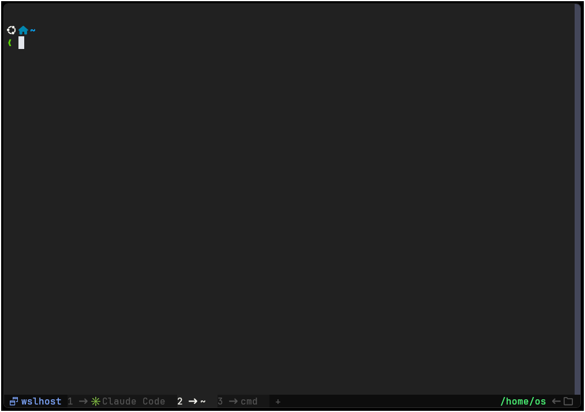

<h2 align="center">WezTerm Config</h2>

<p align="center">
  <a href="https://github.com/OSDDQD/wezterm-config/stargazers">
    
  </a>
  <a href="https://github.com/OSDDQD/wezterm-config/issues">
    
  </a>
  <a href="https://osddqd.github.io/wezterm-config/keybindings-cheatsheet.html">
    
  </a>
</p>

<p align="center">
  Personal <a href="https://wezfurlong.org/wezterm/">WezTerm</a> configuration for Windows + WSL.<br>
  Dark theme · JetBrainsMono Nerd Font · WebGPU renderer · bar.wezterm tab bar
</p>



---

### Features

- **Custom Color Scheme** — dark theme based on a custom Dracula-inspired palette
- **[Background Image Selector](./utils/backdrops.lua)** — cycle, fuzzy-search and toggle wallpapers
- **[GPU Adapter Selector](./utils/gpu-adapter.lua)** — auto-picks the best GPU + graphics API (WebGPU / Dx12 / Vulkan)
- **WSL Integration** — dedicated keybinding to spawn WSL tabs
- **[bar.wezterm](https://github.com/adriankarlen/bar.wezterm) tab bar** — bottom status bar with tab info and cwd
- **Leader key-tables** — modal resize modes for fonts and panes
- **[Keybindings Cheatsheet](./keybindings-cheatsheet.html)** — full HTML reference, open in browser

---

### Requirements

| Dependency | Notes |
|---|---|
| [WezTerm](https://wezfurlong.org/wezterm/installation.html) | Nightly recommended |
| [JetBrainsMono Nerd Font](https://www.nerdfonts.com/) | Primary font |
| [Hack Nerd Font Mono](https://www.nerdfonts.com/) | Fallback font |

**Install WezTerm on Windows:**

```sh
# winget
winget install wez.wezterm

# or scoop
scoop bucket add extras
scoop install wezterm
```

**Install fonts on Windows:**

```sh
scoop bucket add nerd-fonts
scoop install JetBrainsMono-NF Hack-NF-Mono
```

---

### Getting Started

```sh
git clone https://github.com/OSDDQD/wezterm-config.git ~/.config/wezterm
```

**Things you may want to adjust:**

- [`config/domains.lua`](./config/domains.lua) — SSH / WSL domain names
- [`config/launch.lua`](./config/launch.lua) — preferred shells and their paths
- [`utils/backdrops.lua`](./utils/backdrops.lua) — wallpaper directory (defaults to `~/Pictures/Wallpapers/`)

---

### Key Bindings

`SUPER` = <kbd>Alt</kbd> &nbsp;·&nbsp; `SUPER_REV` = <kbd>Alt</kbd>+<kbd>Ctrl</kbd> &nbsp;·&nbsp; `LEADER` = <kbd>Alt</kbd>+<kbd>Ctrl</kbd>+<kbd>Space</kbd>

> Full interactive reference: **[keybindings-cheatsheet](https://osddqd.github.io/wezterm-config/keybindings-cheatsheet.html)**

#### Miscellaneous

| Keys | Action |
|---|---|
| <kbd>F1</kbd> | `ActivateCopyMode` |
| <kbd>F2</kbd> | `ActivateCommandPalette` |
| <kbd>F3</kbd> | `ShowLauncher` |
| <kbd>F4</kbd> | `ShowLauncher` (tabs, fuzzy) |
| <kbd>F5</kbd> | `ShowLauncher` (workspaces, fuzzy) |
| <kbd>F11</kbd> | `ToggleFullScreen` |
| <kbd>F12</kbd> | `ShowDebugOverlay` |
| <kbd>Alt</kbd>+<kbd>F</kbd> | Search text |
| <kbd>Alt+Ctrl</kbd>+<kbd>U</kbd> | Open URL under cursor |

#### Copy / Paste

| Keys | Action |
|---|---|
| <kbd>Ctrl</kbd>+<kbd>Shift</kbd>+<kbd>C</kbd> | Copy to clipboard |
| <kbd>Ctrl</kbd>+<kbd>Shift</kbd>+<kbd>V</kbd> | Paste from clipboard |
| <kbd>Ctrl</kbd>+<kbd>Click</kbd> | Open link under mouse |

#### Cursor

| Keys | Action |
|---|---|
| <kbd>Alt</kbd>+<kbd>←</kbd> | Move to line start |
| <kbd>Alt</kbd>+<kbd>→</kbd> | Move to line end |
| <kbd>Alt</kbd>+<kbd>Backspace</kbd> | Delete to line start |

#### Tabs

| Keys | Action |
|---|---|
| <kbd>Ctrl+Shift</kbd>+<kbd>1</kbd> | New tab (Default Domain) |
| <kbd>Ctrl+Shift</kbd>+<kbd>2</kbd> | New tab (WSL) |
| <kbd>Ctrl+Shift</kbd>+<kbd>D</kbd> | Duplicate tab (same domain + cwd) |
| <kbd>Ctrl+Shift</kbd>+<kbd>W</kbd> | Close tab |
| <kbd>Alt</kbd>+<kbd>]</kbd> | Next tab |
| <kbd>Alt</kbd>+<kbd>[</kbd> | Previous tab |
| <kbd>Alt+Ctrl</kbd>+<kbd>]</kbd> | Move tab right |
| <kbd>Alt+Ctrl</kbd>+<kbd>[</kbd> | Move tab left |
| <kbd>Alt</kbd>+<kbd>0</kbd> | Rename tab |
| <kbd>Alt+Ctrl</kbd>+<kbd>0</kbd> | Reset tab name |
| <kbd>Alt</kbd>+<kbd>9</kbd> | Toggle tab bar |

#### Window

| Keys | Action |
|---|---|
| <kbd>Alt</kbd>+<kbd>N</kbd> | New window |
| <kbd>Alt+Ctrl</kbd>+<kbd>Enter</kbd> | Maximize window |
| <kbd>Alt</kbd>+<kbd>=</kbd> | Increase window size (+50px) |
| <kbd>Alt</kbd>+<kbd>-</kbd> | Decrease window size (-50px) |

#### Panes

| Keys | Action |
|---|---|
| <kbd>Alt</kbd>+<kbd>\\</kbd> | Split vertically |
| <kbd>Alt+Ctrl</kbd>+<kbd>\\</kbd> | Split horizontally |
| <kbd>Alt</kbd>+<kbd>Enter</kbd> | Toggle pane zoom |
| <kbd>Alt</kbd>+<kbd>W</kbd> | Close pane |
| <kbd>Alt+Ctrl</kbd>+<kbd>K/J/H/L</kbd> | Navigate panes (↑↓←→) |
| <kbd>Alt+Ctrl</kbd>+<kbd>P</kbd> | Swap with selected pane |

#### Scroll

| Keys | Action |
|---|---|
| <kbd>Alt</kbd>+<kbd>U</kbd> | Scroll up 5 lines |
| <kbd>Alt</kbd>+<kbd>D</kbd> | Scroll down 5 lines |
| <kbd>Shift</kbd>+<kbd>PageUp</kbd> | Scroll up ¾ page |
| <kbd>Shift</kbd>+<kbd>PageDown</kbd> | Scroll down ¾ page |

#### Background Images

| Keys | Action |
|---|---|
| <kbd>Alt</kbd>+<kbd>/</kbd> | Random background |
| <kbd>Alt+Ctrl</kbd>+<kbd>/</kbd> | Fuzzy select background |
| <kbd>Alt</kbd>+<kbd>,</kbd> | Previous background |
| <kbd>Alt</kbd>+<kbd>.</kbd> | Next background |
| <kbd>Alt</kbd>+<kbd>B</kbd> | Toggle focus mode |

#### Key Tables (Leader modes)

Enter with <kbd>Alt+Ctrl+Space</kbd>, then press key within **1 second**.

| Activation | Table |
|---|---|
| `LEADER` + <kbd>F</kbd> | `resize_font` |
| `LEADER` + <kbd>P</kbd> | `resize_pane` |

**`resize_font`**

| Key | Action |
|---|---|
| <kbd>K</kbd> | Increase font size |
| <kbd>J</kbd> | Decrease font size |
| <kbd>R</kbd> | Reset font size |
| <kbd>Esc</kbd> / <kbd>Q</kbd> | Exit mode |

**`resize_pane`**

| Key | Action |
|---|---|
| <kbd>K/J/H/L</kbd> | Resize pane (↑↓←→) |
| <kbd>Esc</kbd> / <kbd>Q</kbd> | Exit mode |

---

### Project Structure

```
~/.config/wezterm/
├── wezterm.lua                  # Entry point
├── config/
│   ├── appearance.lua           # Colors, cursor, window style
│   ├── bindings.lua             # All keybindings and mouse bindings
│   ├── domains.lua              # SSH / WSL domains
│   ├── fonts.lua                # Font settings
│   ├── general.lua              # General options
│   └── launch.lua               # Shell / launch menu config
├── colors/
│   └── custom.lua               # Custom color scheme
├── events/
│   ├── tab-title.lua            # Tab title logic
│   └── new-tab-button.lua       # New tab button event
├── utils/
│   ├── backdrops.lua            # Background image manager
│   ├── gpu-adapter.lua          # GPU/API auto-selector
│   ├── platform.lua             # OS detection helpers
│   ├── math.lua                 # Math utilities
│   ├── cells.lua                # Cell size helpers
│   └── opts-validator.lua       # Config validation
└── keybindings-cheatsheet.html  # Interactive hotkey reference
```

---

### References

- <https://wezfurlong.org/wezterm/config/files.html>
- <https://github.com/KevinSilvester/wezterm-config> — original config this was forked from
- <https://github.com/adriankarlen/bar.wezterm>
- <https://github.com/catppuccin/wezterm>
